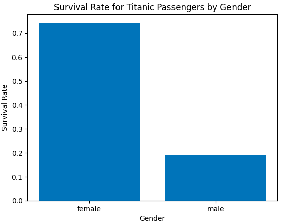
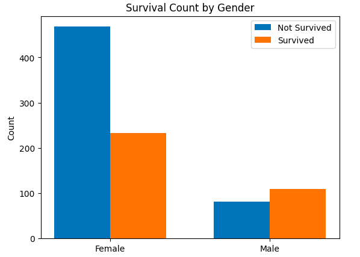
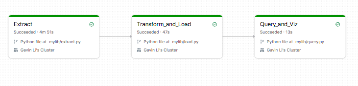
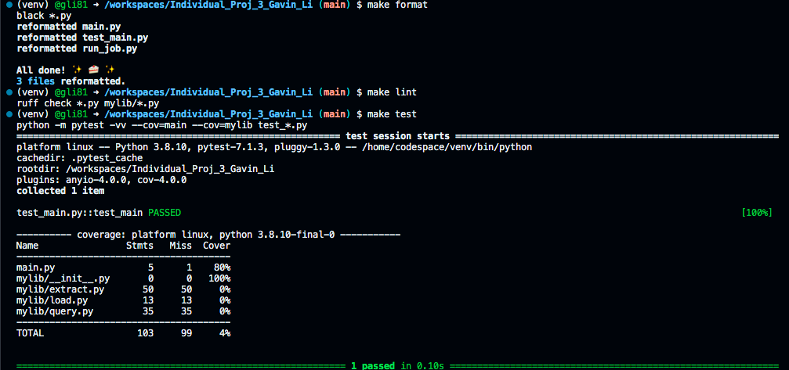

# IDS 706 Data Engineering Individual Project 3
Gavin Li `gl183`

## Purpose of the project
The purpose of this project is to build an ETL data pipeline on Databricks, automate the workflow on the platform, then find some insights from the data.

## Video explanation

[Here is the link to the video that explains this project](www.youtube.com)

## Dataset

The Titanic dataset, a comprehensive collection of passenger information from the infamous 1912 maritime disaster, offers an overview for exploring various facets of machine learning and data analysis, including data on demographics, ticket class, fare, and survival, thereby serving as a cornerstone in predictive modeling and historical insights.

## ETL data pipeline

- __[E]xtract__

  Retrived the data from the data source using python `requests` package, then stored the data in databricks using the `dbfs` protocol as a `.csv` file.

- __[T]ransform__

  Dropped unnecessary columns, leaving only the variables that are useful to later analysis (e.g., `Survived`, `Sex`, `Pclass`) using __`PySpark`__.

- __[L]oad__

  Loaded the transformed data set into a __delta lake table__ as a data sink.

## Insight, Data visualization, Conclusion

I __queried__ the delta lake table to get some insights from it regarding the imbalance of survival rate in different gender, and made the following __visualizations__.

- Visualization 1: Survival rate of Titanic passengers by gender

- Visualization 2: Count of survived / not survived of Titanic passengers by gender

- __Insight__

The Titanic dataset analysis reveals a significant imbalance in survival rates between genders. Women had a markedly higher survival rate compared to men, highlighting the impact of the "women and children first" protocol during the disaster.

## Databricks Workflow

- Automated trigger

The ETL pipeline workflow is automated using databricks workflow and `run_job.py` script, which sends a POST request to the server to start a specified job, given a `JOB_ID`. Here is the result of the workflow:

## Result of `make format`, `make lint`, `make test`

## Reference
[Professor Noah's ruff template](https://github.com/nogibjj/python-ruff-template)